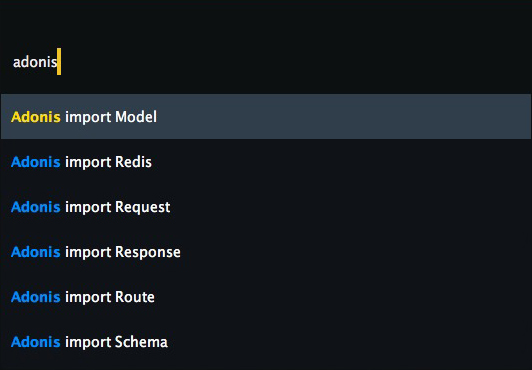
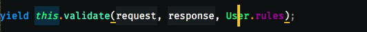

# adonis-sublime
adonisJs snippets for SublimeText

## Usage

1- All the snippets start with `ado-`, like 
> ado-req, ado-res, etc...

2- All the empty triggers use thier original names, like 
> ado-linkTo, ado-appPath, etc...

3- For validatin & sanitization "rules / raw", you just write the name, like
> array, required, etc...

| NAME                 | TRIGGER          |
|:---------------------|:-----------------|
| ace                  | a                |
| controller           | c                |
| encryption           | enc              |
| event                | e                |
| hash                 | ha               |
| internationalization | ant              |
| lucid                | m                |
| lucid (hooks)        | mhook            |
| mail                 | m                |
| nunjucks             |                  |
| nunjucks (filters)   | fltr_            |
| nunjucks (form)      | form             |
| helpers              |                  |
| query                | q                |
| redis                | red              |
| request              | req              |
| request (auth)       | reqauth          |
| request (ally)       | reqally          |
| request (cookie)     | reqcookie        |
| request (session)    | reqsession       |
| response             | res              |
| routes               | r                |
| routes (group)       | rGr              |
| schema               | schema           |
| schema (table)       | t                |
| seeder(factory)      | factory          |
| seeder(faker)        | f                |
| env                  | get/set Env      |
| config               | get/set Conf     |
| validation           | v                |
| validation (rules)   |                  |
| validation (raw)     |                  |
| view                 | v                |
| globals              | orFail / dbBebug |

---

For easier working with things like `const Helpers = use('Helpers')`, just bring up the quick panel and type `adonis`

Except for `Model` you have to put the cursor over the model name first, like

Which adds `const User = use('App/Model/User')` to the top of the file.

